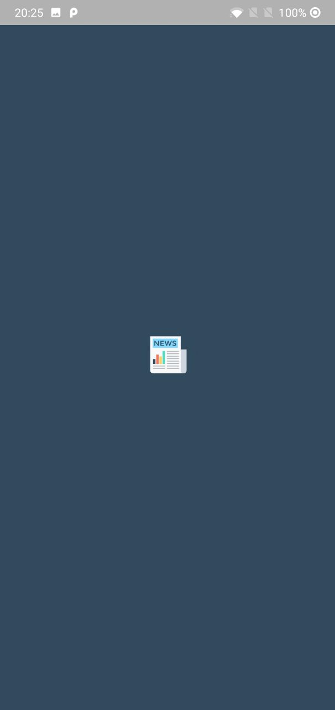
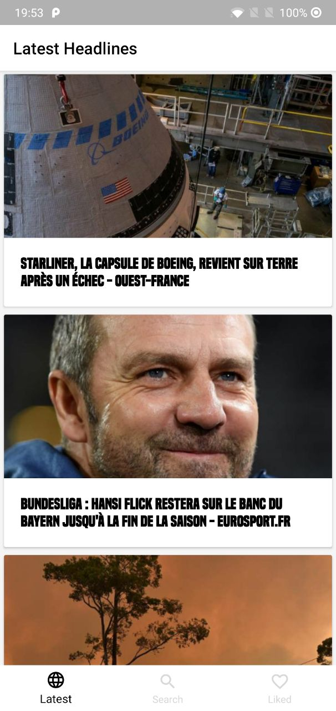
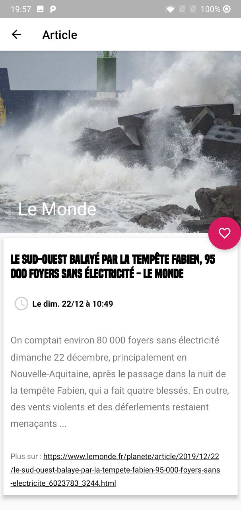
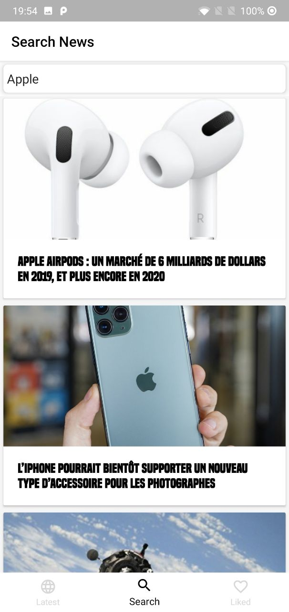
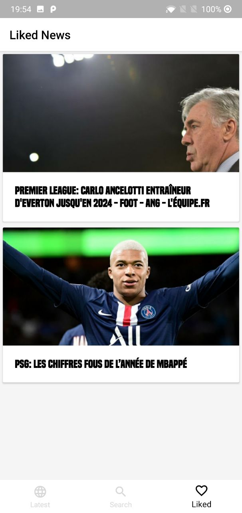
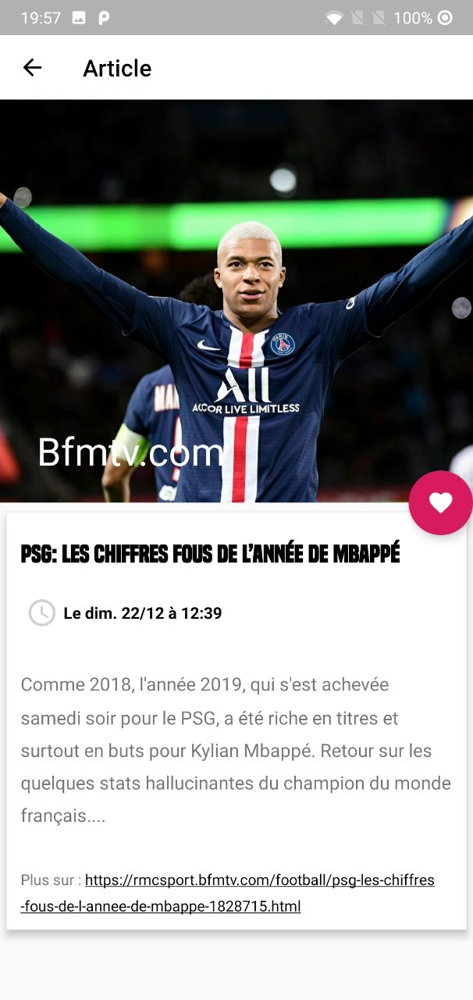

# Neys

Neys is an Android app who uses [News API](https://newsapi.org/)
 to retrieve press articles.

## Installation
- `git clone https://github.com/yohanleb/Neys.git`

- Open project in Android Studio

## Features

- MVC Architecture
- REST API Call
- Singleton for API Instance
- Fragments
- Displaying a list in a RecyclerView
- Displaying a detail view of an article
- Gitflow
- Animations between two views
- Data stored in cache
- More features : 
	- Search articles
	- Like articles
	- Material Cards
	- Material Bottom Navigation
	- Splash Screen

### Splash Screen

The first screen is a loading screen with the Neys logo.

### Top Headlines

You can view the top headlines in the main screen.

### Read an article

You can read an article by clicking on it in the list.

This view shows the image, the source of the article, the title, and the content.
Unfortunately, News API only offers the beginning of the article (for free users), so I added a link to see the full article.

You can also like an article by clicking on the heart.

### Search an article

You can search articles by typing some words in the search bar.

### Like an article

All your liked articles are stored in this view.

### Animations
There are animations between two views.

## Warning
The data showed belongs to News API, the images or the names can be incorrect.

## Used librairies
[Gson](https://github.com/google/gson)

[Retrofit](https://github.com/square/retrofit)

[RecyclerView](https://developer.android.com/guide/topics/ui/layout/recyclerview)

[Picasso](https://square.github.io/picasso/)

## Inspirations

[Google News](https://news.google.com/)
